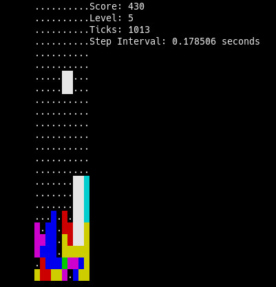
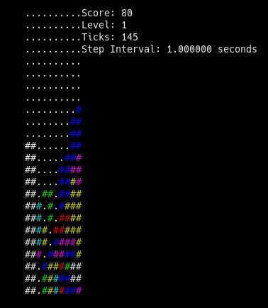

# FALLING BLOCKS

#### w/ `-solid` color mode:

#### w/ `-ascii` color mode:

**Description:** This is a clone of the well-known game of falling puzzle blocks. It is written in C and relies on the ncurses library. It runs the whole game in the terminal when the user runs the executable and then resumes business-as-usual when the game is over. **'a', 's', 'd'** keys to move left, down, and right. **'f'** key to rotate the tetromino. **'p'** to pause the game. Press **'CTRL+C'** to exit, except during the game over screen when you'll be prompted to quit with **'q'**. 

**Options:** `-easy`, `-medium`, and `-hard` set the size of the speed decrements for each new level (so harder means the blocks fall faster sooner). `-ascii` and `-solid` set the symbols used for the tetromino blocks (solid gives a more arcade-like appearance). By default no color is used. An example might be `./blocks -easy -ascii` or `./blocks -solid -hard`. Some players might find it easier to "line up" the tiles using the `-ascii` setting instead of the `-solid` setting.

**State of the Project:** pre-0.0.1. Like a car with just an engine, wheels, loud muffler, one headlight, and a frame. It can be played from start to finish for as long as you like. It can take awhile to ramp up to high difficulty, and the nature of the input system makes it very difficult once it gets there, but it's totally good for an hour or two of fun. I was going to re-make this in Rust rather than continue working on it in C, but while writing recent updates I was reminded how much I like C. Eventually I'll re-write it in Rust, but for the foreseeable future I'll continue using C. I have included my TODO list in the repo (which I had previously just kept local) so anyone interested can see what I plan on implementing, in no particular order. 

**Installation/Dependencies:** If you want to use this you'll need to build it yourself by following these steps:
1. Make sure you have `gcc` installed, along with basic build tools. On Debian-based systems like Ubuntu this is all usually in a package called `build-essential`. You'll also need `libncurses5-dev` (the version I had when writing it) or later, which you can also find in your distribution repositories. On Arch all you should need is `base-devel`. Consult your distribution's repositories for more information if you're on another distro.
2. If you have `make` (which is typically included in `build-essential`, `base-devel`, and similar packages) then simply type `make` while in the project directory. If you want to hack on the game yourself then build with `make debug` to get warnings and debugging symbols.
3. You should now have an executable file named `blocks` and you can run the game with: `./blocks [OPTIONS]`

**Disclaimer:** I am not a professional programmer, although I did enjoy making this a lot. Compile and run at your own risk. Almost everything happens "in-place" and it has a very small memory footprint. Note that it is normal for ncurses to show some memory still in use after the program ends, if you test with valgrind, unless you go out of your way to disable this (because of the memory responsible for the terminal itself). All allocations made by the program are freed, however (and are currently very minimal anyway). The functions which govern the rotation of tetrominos and actual display logic are *extremely naive*. Anyone who wants to mess with it is 100% welcome to do so; I have left comments in some of the most pertinent parts of the code where performance or style is a real issue. I had a lot of fun writing this and sharing is caring, so have at it. 

**References:** Some resources were helpful while making this program so far:
- *C Programming, a Modern Approach (2nd Edition)* by K.N. King. I surely am not doing this fine book justice by mentioning it in the same breath as my naive and unoptimized prototype, but it really is a wonderful book and was extremely helpful.
- Wikipedia has a good page on tetrominos.
- The ncurses documentation
- I got some great advice from the friendly people at Freenode IRC's ##programming channel and ##c channel.

